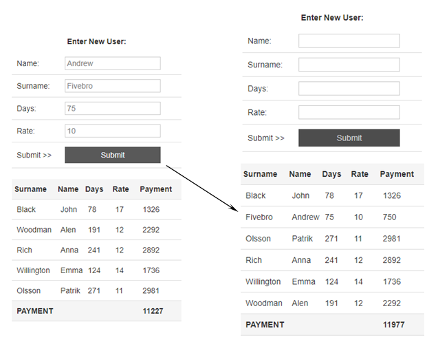

# USER-LIST

## Основное задание
При помощи инструментов JavaScript, HTML, CSS и фреймворков (будет преимуществом) реализовать следующее:

Дан массив с пользователям. У каждого пользователя есть имя, фамилия, количество дней 
пользования сервисом и дневная ставка пользования (целые числа). 

Выведите этих пользователей на экран в виде таблицы. 

Сделайте так, чтобы в последней колонке автоматически рассчитывалась общая плата пользования 
(количество дней пользования умножить на ставку). 

Под таблицей также выведите суммарную плату всех пользователей.

## Дополнительно

Сделайте так, чтобы можно было добавлять новых пользователей, для чего предусмотрите форму ввода над таблицей. 

Предусмотрите изменение и удаление пользователей. Удаление должно производиться по двойному клику на 
таблице пользователей, причем вся информация об удаленном пользователе автоматически переносилась бы
в форму ввода, где ее можно будет отредактировать (таким образом, реализуйте совместных механизм редактирования или удаления пользователей).

Предусмотрите возможность сортировки таблицы при нажатии на заголовки столбцов.

Предусмотрите валидацию полей ввода (имена и фамилии должны быть строками, а дни пользования и ставка,
соответсвенно целыми числами).

<i> Реализация - Production под NodeJS </i>
